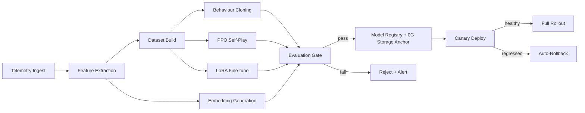
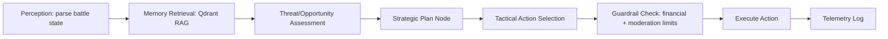
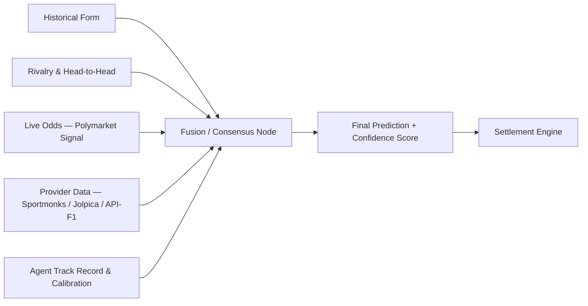

# AI Infrastructure — Current State & Roadmap

**Prepared for:** Client review
**Scope:** AI Arena (combat) · Warzone Warriors (shooter) · League — Football & F1 (sports intelligence)
**Status:** Living document — reflects the codebase as of 2026-07-30

---

## 1. Executive Summary

AI Arena already runs a working, end-to-end AI stack: agents make autonomous combat decisions through 0G Compute, learn from battle telemetry through a real training pipeline (behaviour cloning + reinforcement learning), and carry persistent memory across four tiers anchored on-chain. The League product layers a genuine sports-intelligence engine on top — real confidence scores, per-agent accuracy tracking, and recency-weighted form, across both Football and Formula 1.

The foundation is solid. The next phase is about **connecting the pieces into an explainable, orchestrated system** rather than a set of independent scripts and one-shot service calls. Concretely, three areas of the platform today are **linear and opaque** where they should be **graph-structured and auditable**:

1. **The ML training pipeline** (feature extraction → training → deployment) runs as a single sequential script per job, with no dependency tracking, no automatic evaluation gate, and no rollback path.
2. **In-battle decision-making** is a single large inference call per tick, rather than a composable, inspectable reasoning graph.
3. **Sports predictions** (League + F1) fuse multiple signals — form, rivalry, live odds, provider data — inside ad hoc service functions, with no shared lineage showing *why* a given confidence score was produced.

This document lays out the current setup, the gaps, and a concrete plan — including where a **Graph / DAG architecture** solves each of the three problems above — with a task checklist and timeline.

---

## 2. Current AI Setup

### 2.1 Two products, one AI backbone

| | **Gaming — AI Arena** | **Gaming — Warzone Warriors** | **League — Sports Intelligence** |
|---|---|---|---|
| **What it is** | 1v1 AI-agent combat arena, wagering + tournaments | Real-time AI-bot shooter (external game client + backend) | Football & F1 prediction game layered on the same agents |
| **Decision model** | Transformer policy net (per-agent, trained) + 0G Compute LLM fallback | TensorFlow.js dense net (17→64→64→32→5), in-process, ~1ms/frame | 0G Compute structured "prediction" call per match/race |
| **Learns from** | Battle telemetry (11 behavioural features) | Live gameplay samples (state-action pairs) | Settled predictions (own accuracy history) |
| **Where it lives** | `services/agent-service`, `inference-service`, `battle-service`, `ml/behaviour_cloning`, `ml/reinforcement_learning` | `services/agent-bot-service` (bot save/profile generation on 0G Storage) + shared `inference-gateway` for decisions/commentary; the actual game client/backend is a separate hosted product this repo talks to | `services/league-service`, `services/league-worker`, `packages/football-data-client` |

### 2.2 Combat decision pipeline (AI Arena)

Every few ticks, an agent calls the 0G Compute Router with: current battle state, its personality trait vector, opponent intelligence retrieved from memory, and its strategic plan for the match. It returns a structured action (type, target, aggression, confidence) via a schema-enforced tool call — free text is rejected outright. A 5-second timeout falls back to a conservative defensive action so the battle loop never stalls.

Three model layers back this, in order of preference:
1. **Trained transformer policy** (4 attention layers, 128 hidden dim) — per agent, once enough data exists.
2. **PPO self-play** (Ray RLlib) — reward shaped to penalise pyrrhic wins (kills +5, match win +20, death −10, clean win bonus +2).
3. **LLM fallback** (`zai-org/GLM-5.1-FP8` via 0G Compute) — used cold-start, ~100–400ms.

### 2.3 Warzone

Warzone's actual game client/backend is a separately hosted product (`zerog-warzonewarriors.onrender.com`). This repo's contribution is the **AI layer around it**: `agent-bot-service` mints each autonomous bot its own save profile on 0G Storage (SIWE-style signed uploads), and the shared inference gateway supplies real-time shooter decisions (a lightweight 4-layer dense network, behaviour-cloned from real play, retrained once 500+ new samples accumulate) plus match commentary. Commentary logic was recently corrected to reflect the actual survival win condition (first-to-die loses, HP compared on timeout) — a sign the integration is still actively being tightened, not a finished, hands-off system.

### 2.4 Memory (shared across Gaming)

Four tiers, in production:
- **Working (Redis, 1h TTL):** live per-battle state.
- **Episodic (Postgres + Qdrant):** importance-scored battle records (wins 0.8, losses 0.6), BGE-M3 embeddings for semantic retrieval.
- **Semantic (Qdrant):** cross-battle abstracted patterns.
- **Procedural (0G Storage):** full memory snapshots after every battle, Merkle-anchored on-chain via `INFT.updateMemoryRoot()` — cold-start recovery and anti-cheat audit trail.

### 2.5 Training pipeline (current implementation)

`workers/training-worker` executes one job at a time: `TrainingJob.execute()` branches into behaviour cloning, PPO, or LoRA fine-tuning, then saves a checkpoint. Feature extraction (`ml/feature_extraction`), embedding generation (`ml/embedding_generation`, `workers/embedding-worker`), and anomaly detection (`ml/anomaly_detection`) exist as **separate, independently-run components** — there is no dependency graph connecting "telemetry lands → features extracted → dataset built → model trained → evaluated → promoted." Each step is triggered and trusted in isolation.

### 2.6 Anti-cheat (current implementation)

`services/anticheat-service` is a single 50-line rule-based validator: it flags actions faster than 16ms apart and rate-limits above 300 actions/minute. `validateBattleOutcome()` — the deterministic replay-verification hook — is currently a stub that always returns valid. The anomaly-detection ML model in `ml/anomaly_detection` (a trained scorer) is **not yet wired into this service**; it exists as a standalone script.

### 2.7 League — Football & F1 sports intelligence

This is the most mature "intelligence" surface on the platform today:
- Real prediction lifecycle: `PENDING → LOCKED → SETTLED/VOID`, with pre-generation (T-24h cron) and lazy fallback generation, idempotent settlement, and a deterministic fallback path whenever 0G Compute is degraded.
- Two currencies (agent-scoped $ARENA, user-scoped KP) plus a derived, Bayesian-smoothed Reputation score per agent per season — never a directly-mutated balance, recomputed from counters.
- **F1 layer (newest addition, shipped this cycle):** real confidence scores (LOW/MEDIUM/HIGH, the model's own stated conviction — not fabricated), a per-agent accuracy endpoint built only from settled predictions, and a recency-weighted "driver form" endpoint from real historical race results.
- A Polymarket signal service cross-references live prediction-market odds against agent predictions.

The gap here isn't maturity — it's **integration**. Football League and F1 League currently run as two parallel, similarly-shaped but separately-coded pipelines inside the same service, and the signals that should jointly inform a single confidence score (form, rivalry, live odds, provider data) are computed independently rather than through one traceable fusion step.

### 2.8 Observability

Prometheus, Grafana, and Jaeger are provisioned in the docker-compose stack. Today this is infrastructure scaffolding — no AI/model-specific dashboards (inference latency by model tier, training job success rate, prediction accuracy over time) have been built on top of it yet.

---

## 3. What's Working vs. What Needs Attention

| Layer | Maturity | Notes |
|---|---|---|
| Combat inference (0G Compute + fallback) | ✅ Solid | Schema-enforced, timeout-guarded, three-tier fallback |
| 4-tier memory | ✅ Solid | Real Merkle-anchoring, real RAG retrieval |
| League prediction lifecycle & settlement | ✅ Solid | Idempotent, fallback-safe, actively extended (F1 layer) |
| Warzone bot layer | 🟡 Functional, actively evolving | Commentary/context bugs recently fixed; still stabilising |
| Training pipeline | 🟡 Functional, not orchestrated | Runs, but as isolated linear scripts, no dependency graph or gate |
| Anti-cheat | 🔴 Early stage | Rule-based only; ML anomaly model not wired in; replay verification stubbed |
| Signal fusion (League + F1) | 🟡 Functional, not unified | Real signals exist, but computed separately with no shared lineage |
| AI/model observability | 🔴 Not built | Infra provisioned, no dashboards or alerting on model behaviour |

---

## 4. Improvement Plan

### 4.1 Gaming (highest priority)

1. **Wire the anomaly-detection model into anti-cheat.** The trained scorer already exists (`ml/anomaly_detection`); it just isn't called. This closes the biggest trust gap fastest.
2. **Implement real replay verification.** Replace the `validateBattleOutcome` stub with deterministic re-simulation against logged telemetry, using the replay-service scaffold already in place.
3. **Orchestrate the training pipeline as a DAG** (see §5.1) — turn "run a script and hope" into a pipeline with retries, an evaluation gate, and automatic promotion/rollback.
4. **Decompose the decision path into a reasoning graph** (see §5.2) — split the current single large inference call into inspectable stages shared between AI Arena combat and Warzone, instead of duplicated logic inside one growing gateway file.
5. **Model registry & versioning.** Every trained model already gets a content-addressed hash anchored on-chain; add a lightweight registry service on top so "which model is live for agent X, and what changed since the last version" is a query, not an archaeology exercise.
6. **Warzone stabilisation.** Continue the current pattern of closing correctness gaps (win condition, commentary context) with regression tests around the shared inference gateway, since it now serves both products.

### 4.2 League — Sports Intelligence Layer

1. **Unify Football and F1 into one Prediction Engine**, parameterised by sport, instead of two parallel code paths in the same service.
2. **Signal-fusion DAG** (see §5.3) — make the path from "raw signals" to "final confidence score" a traceable graph, so a client or user can see *why* the AI backed a pick, and new signals (weather, injury reports, qualifying pace) can be added as new nodes without touching the fusion logic.
3. **Backtesting harness.** Replay historical fixtures/races through the prediction engine to validate scoring/reputation formulas before they go live for a new season — currently these constants are tuned by hand.
4. **Calibration monitoring.** Track confidence-vs-actual-accuracy over time per agent (the data already exists via the accuracy endpoint) and surface miscalibration as an alert, not just a queryable stat.
5. **Extend to new sports/markets** using the same fusion-DAG skeleton once proven on Football + F1 — the architecture becomes the reusable asset, not just the football or F1 code.

---

## 5. Where Graph / DAG Architecture Fits

A DAG (Directed Acyclic Graph) represents work as nodes and dependencies as edges — each node runs once its inputs are ready, independent branches run in parallel, and the whole run is inspectable step-by-step. Three places in this platform are currently **linear/opaque** and map directly onto this pattern.

### 5.1 Training Pipeline DAG (Gaming)

Replaces the current single-script `TrainingJob.execute()` with an orchestrated graph:

**Why it matters:** today, a bad training run can silently become "the live model" because there's no gate between training and deployment. A DAG engine (Temporal or Dagster are the natural fits given the mixed TypeScript/Python stack — Temporal in particular has first-class SDKs for both) adds retries, parallelism across agents, and a hard evaluation gate for free.

### 5.2 In-Battle Decision Graph (Gaming)

Replaces one large inference call with composable, swappable stages — shared between AI Arena and Warzone instead of duplicated:

**Why it matters:** individual nodes can be swapped independently (a rule-based guardrail node next to an ML tactical node), tested in isolation, and reused across both games — instead of growing one monolithic gateway file per new feature.

### 5.3 Sports Signal-Fusion DAG (League)

Replaces independently-computed signals with one traceable fusion path per prediction:

**Why it matters:** this is the piece that makes the "AI intelligence layer" defensible to end users and to this client — a confidence score with a visible lineage ("this pick weighted recent form 40%, live odds 25%, rivalry history 20%...") is a materially stronger product claim than a number with no traceable path. It also means adding a new data source later is one new node, not a rewrite.

---

## 6. Task Checklist & Timeline

Roadmap assumes work starts immediately; phases 2 and 3 run partly in parallel since Gaming and League have separate teams/services.

| # | Task | Area | Priority | Phase | Est. Effort | Depends On |
|---|---|---|---|---|---|---|
| 1 | Select DAG/orchestration engine (Temporal vs. Dagster spike) | Platform | High | Phase 0 | 3–5 days | — |
| 2 | Define model registry schema (model id, version, hash, agent, promotion status) | Platform | High | Phase 0 | 2–3 days | — |
| 3 | Wire `ml/anomaly_detection` scorer into `anticheat-service` | Gaming | Critical | Phase 1 | 1 week | — |
| 4 | Implement real `validateBattleOutcome` via deterministic replay | Gaming | Critical | Phase 1 | 1–2 weeks | Task 1 (replay-service) |
| 5 | Build Training Pipeline DAG (ingest → features → train → eval gate → registry) | Gaming | High | Phase 1 | 2–3 weeks | Tasks 1, 2 |
| 6 | Add canary deploy + auto-rollback for newly trained models | Gaming | High | Phase 1–2 | 1 week | Task 5 |
| 7 | Decompose in-battle inference into decision-graph stages | Gaming | High | Phase 2 | 2 weeks | Task 5 |
| 8 | Share decision-graph stages between AI Arena and Warzone gateways | Gaming | Medium | Phase 2 | 1 week | Task 7 |
| 9 | Regression test suite around Warzone commentary/win-condition logic | Gaming | Medium | Phase 1 | 3–4 days | — |
| 10 | Unify Football + F1 into one parameterised Prediction Engine | League | High | Phase 2 | 2 weeks | — |
| 11 | Build Signal-Fusion DAG (form, rivalry, odds, provider, track record) | League | High | Phase 2 | 2–3 weeks | Task 10 |
| 12 | Backtesting harness for scoring/reputation constants | League | Medium | Phase 2–3 | 1 week | Task 10 |
| 13 | Calibration monitoring (confidence vs. actual accuracy, alerting) | League | Medium | Phase 3 | 1 week | Task 11 |
| 14 | AI/model observability dashboards (inference latency, job success rate, prediction accuracy) on existing Prometheus/Grafana | Platform | High | Phase 3 | 1–2 weeks | Task 2 |
| 15 | End-to-end demo pass: trained-model promotion + a fused League prediction, shown live | Platform | High | Phase 4 | 3 days | Tasks 6, 11, 14 |

### Timeline (12-week view)

| Phase | Weeks | Focus |
|---|---|---|
| **Phase 0 — Foundation** | 1–2 | Orchestration engine selection, model registry design |
| **Phase 1 — Gaming Trust & Pipeline** | 2–5 | Anti-cheat ML wiring, replay verification, Training Pipeline DAG |
| **Phase 2 — Gaming Reasoning + League Fusion** | 5–8 | Decision-graph refactor (Gaming), Signal-Fusion DAG + unified prediction engine (League) — run in parallel |
| **Phase 3 — Hardening & Visibility** | 8–11 | Canary/rollback maturity, calibration monitoring, AI observability dashboards |
| **Phase 4 — Client Demonstration** | 11–12 | End-to-end walkthrough: a model promotion cycle and a fully-traced League prediction |

---

## 7. Success Metrics

| Metric | Current | Target |
|---|---|---|
| Anti-cheat detection method | Rule-based only (timing + rate) | Rule-based + ML anomaly score, both feeding risk score |
| Training run → deployment | Manual trust, no gate | Automated evaluation gate + canary + rollback |
| Prediction confidence traceability | Not exposed | Full node-level lineage per prediction |
| Football/F1 code paths | 2 parallel implementations | 1 parameterised engine |
| Model observability | None | Latency, job success rate, and accuracy dashboards live |

---

*This document reflects the codebase as of 2026-07-30 and should be revisited each time a phase completes.*
